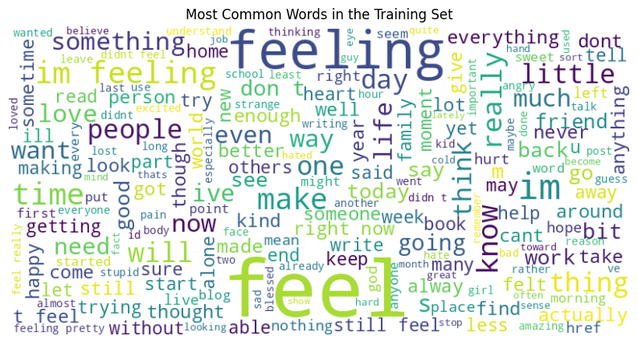

# Text Classification with DistilBERT

This notebook demonstrates text classification using a fine-tuned DistilBERT model from the Hugging Face Transformers library. Through exploratory data analysis, feature extraction, and model fine-tuning, significant improvements in accuracy were achieved.

## Overview

Text classification is the task of assigning predefined categories or labels to text documents. In this notebook, we focus on classifying English Twitter messages into six basic emotions: anger, fear, joy, love, sadness, and surprise.

## Notebook Contents

1. **Introduction**: Brief overview of the project and objectives.
2. **Data Loading and Exploration**: Loading the Emotion dataset and exploring its structure and contents.
3. **Data Preprocessing**: Preprocessing the text data for model training.
4. **Model Training**: Fine-tuning the DistilBERT model for text classification.
5. **Model Evaluation**: Evaluating the trained model's performance on the validation set.
6. **Error Analysis**: Analyzing errors and potential issues in model predictions.
7. **Conclusion**: Summary of key findings and next steps.

## Credits

This notebook was inspired by the book "Natural Language Processing with Transformers" by Lewis Tunstall, Leandro Von Werra, and Thomas Wolf.

---